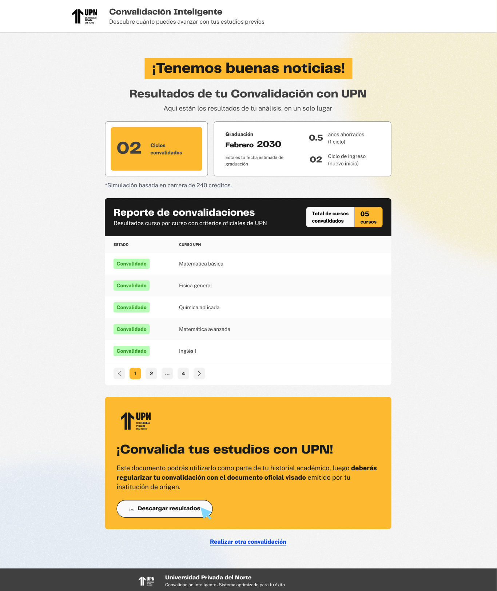

# Guía Visual: descarga-convalidacion-oficial (02-convalidacion-completa)
**Payload General:** [../02-convalidacion-completa/descarga-convalidacion-oficial.yaml](../02-convalidacion-completa/descarga-convalidacion-oficial.yaml)

---
## Instancia: descargar_convalidacion_oficial
- **Descripción:** Cuando el usuario hace clic en el botón de descarga del documento oficial de convalidación completa.



**Data Layer (Payload):**
```yaml
{
  "event"            : "ui_interaction",                    # Nombre fijo del evento
  "ui_location"      : "banner_section",                    # Dónde está el elemento
  "ui_element"       : "button",                            # Qué es el elemento
  "ui_action"        : "click",                             # Qué hace (open_modal, navigation, etc.)
  "ui_label"         : "descargar_convalidacion_oficial",   # Identificador único o texto del elemento. (En este caso es "descargar convalidacion oficial")
  "ui_hierarchy"     : "home > convalidacion > completa",   # Identificador semantico de la seccion donde se ubica. En este caso convalidacion completa.
  "path_location"    : "/convalidacion-completa",           # Path de donde se mide el evento.
}
```
