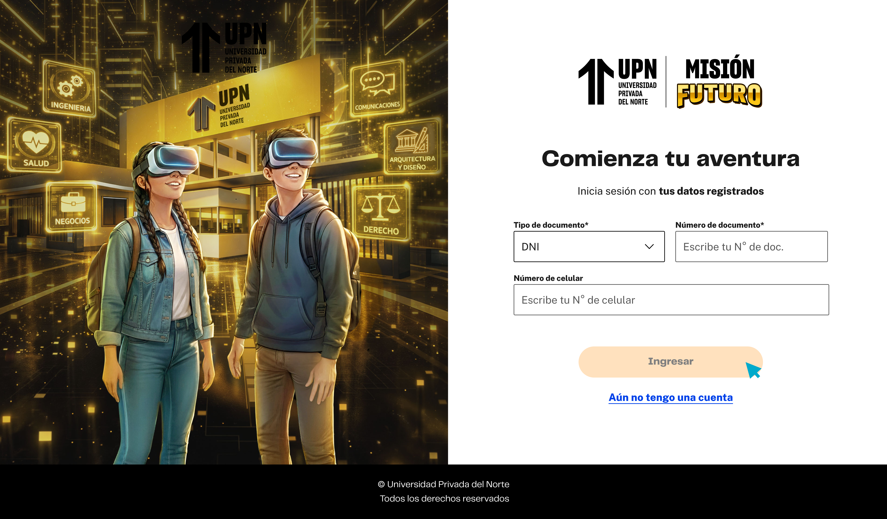

# Guía Visual: login (00-registro)
**Payload General:** [../00-registro/login.yaml](../00-registro/login.yaml)

---
## Instancia: login
- **Descripción:** Cuando el usuario hace clic en el botón para iniciar sesión (submit) si ya tiene una cuenta.



**Data Layer (Payload):**
```yaml
{
  "event"          : "ui_interaction",                               # Nombre fijo del evento
  "ui_location"    : "form_container",                               # Dónde está el elemento
  "ui_element"     : "button",                                       # Qué es el elemento
  "ui_action"      : "submit",                                       # Qué hace (open_modal, navigation, etc.)
  "ui_label"       : "login",                                        # Identificador único o texto del elemento. (En este caso Login)
  "ui_hierarchy"   : "home > registro",                              # Identificador semantico de la seccion donde se ubica. (En este caso es Registro)
  "path_location"  : "/iniciar-sesion",                              # Path de donde se mide el evento.
  "user_code"      : "{{id_usuario}}"                                # Codigo de usuario (alumno o prespecto, código de Hubspot)
}
```
