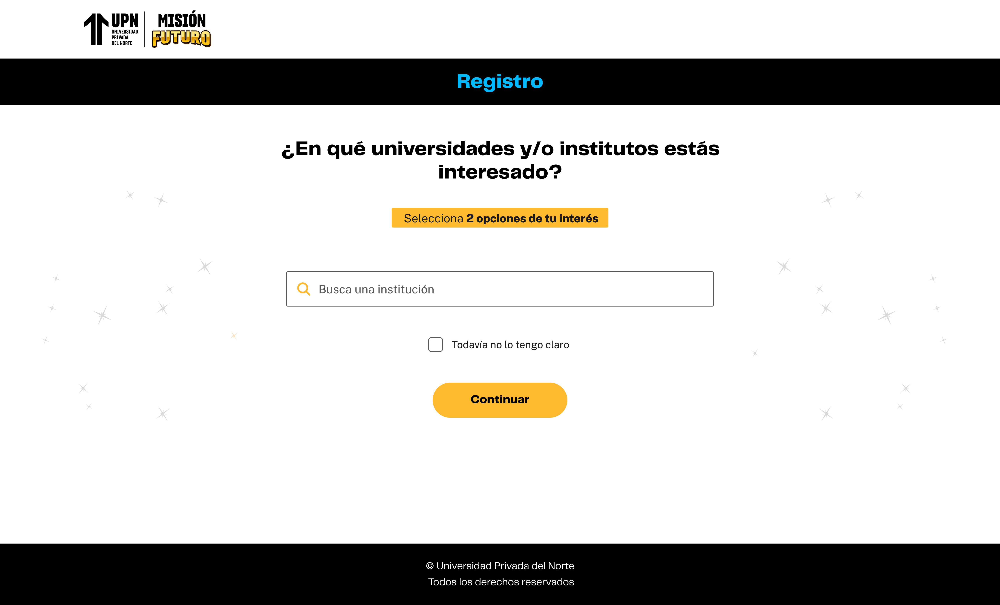
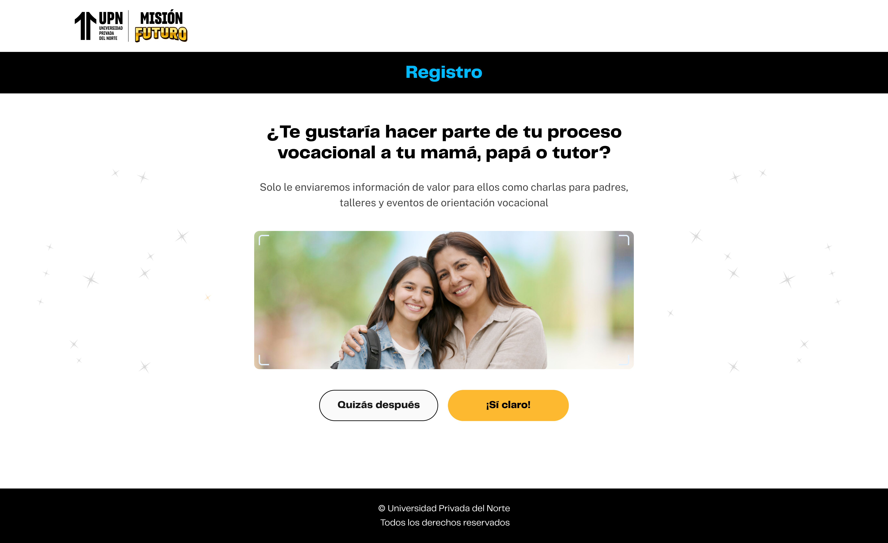
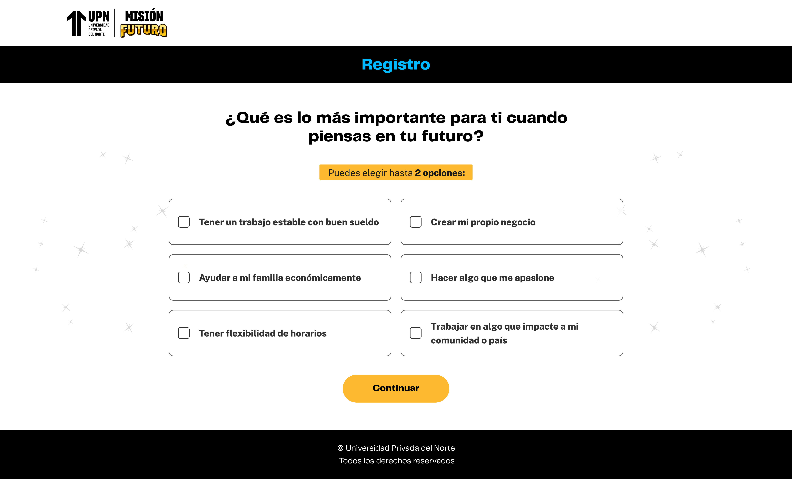
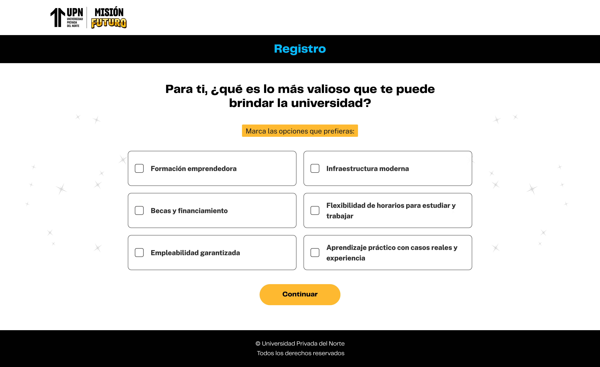

# Guía Visual: mision-futuro (00-registro)
**Payload General:** [../00-registro/mision-futuro.yaml](../00-registro/mision-futuro.yaml)

Este evento de interacción se dispara cada vez que el usuario hace clic en el botón "Continuar" para avanzar en los pasos del formulario del proceso de Registro.

### Resumen de Instancias por Paso


| Instancia (asset) | Pregunta del paso | `ui_hierarchy` | `path_location` | `data_collected` (ejemplo) |
|---|---|---|---|---|
| `enviar_solicitud_00` | ¿En qué universidades y/o institutos estás interesado? | `home > registro > institucion` | `/registro/institucion` | "Ni idea que estudiar" |
| `enviar_solicitud_01` | ¿Te gustaría hacer parte de tu proceso vocacional a tu mamá, papá o tutor? | `home > registro > tutor` | `/registro/tutor` | "Si Claro" |
| `enviar_solicitud_02` | ¿Qué es lo más importante para ti cuando piensas en tu futuro? | `home > registro > futuro` | `/registro/futuro` | "Hacer algo que me apasione" |
| `enviar_solicitud_03` | Para ti, ¿qué es lo más valioso que te puede brindar la universidad? | `home > registro > importante` | `/registro/importante` | "Infraestructura moderna" |


---
## Instancia: enviar_solicitud_00 — ¿En qué universidades y/o institutos estás interesado?
- **Descripción:** Este evento se envía cuando el usuario hace clic en el botón "Continuar" dentro del paso "¿Qué tal vas con el tema de la universidad?" del formulario de registro.



**Data Layer (Payload):**
```yaml
{
  "event"          : "ui_interaction",                               # Nombre fijo del evento
  "ui_location"    : "content_body",                                 # Dónde está el elemento
  "ui_element"     : "button",                                       # Qué es el elemento
  "ui_action"      : "click",                                        # Qué hace (open_modal, navigation, etc.)
  "ui_label"       : "continuar",                                    # Identificador único o texto del elemento. (En este caso Continuar)
  "ui_hierarchy"   : "home > registro > institucion",                # Identificador semantico de la seccion donde se ubica. Dinamico por paso (ej: home > registro > donde_estas_tu o home > registro > tus_planes)
  "path_location"  : "/registro/institucion",                        # Path de donde se mide el evento.
  "data_collected" : "Ni idea que estudiar",                         # Opciones que marca en el formulario, en los pasos de autonocimiento, por ejemplo País donde desea estudiar, si conoce a la UPC.
}
```

---
## Instancia: enviar_solicitud_01 — ¿Te gustaría hacer parte de tu proceso vocacional a tu mamá, papá o tutor?
- **Descripción:** Este evento se envía cuando el usuario hace clic en el botón "Continuar" dentro del paso "¿Te gustaría hacer parte de tu proceso vocacional a tu mamá, papá o tutor?" del formulario de registro.



**Data Layer (Payload):**
```yaml
{
  "event"          : "ui_interaction",                               # Nombre fijo del evento
  "ui_location"    : "content_body",                                 # Dónde está el elemento
  "ui_element"     : "button",                                       # Qué es el elemento
  "ui_action"      : "click",                                        # Qué hace (open_modal, navigation, etc.)
  "ui_label"       : "continuar",                                    # Identificador único o texto del elemento. (En este caso Continuar)
  "ui_hierarchy"   : "home > registro > tutor",                      # Identificador semantico de la seccion donde se ubica. Dinamico por paso (ej: home > registro > donde_estas_tu o home > registro > tus_planes)
  "path_location"  : "/registro/tutor",                              # Path de donde se mide el evento.
  "data_collected" : "Si claro",                                     # Opciones que marca en el formulario, en los pasos de autonocimiento, por ejemplo País donde desea estudiar, si conoce a la UPC.
}
```

---
## Instancia: enviar_solicitud_02 — ¿Qué es lo más importante para ti cuando piensas en tu futuro?
- **Descripción:** Este evento se envía cuando el usuario hace clic en el botón "Continuar" dentro del paso "¿Qué es lo más importante para ti cuando piensas en tu futuro?" del formulario de registro.



**Data Layer (Payload):**
```yaml
{
  "event"          : "ui_interaction",                               # Nombre fijo del evento
  "ui_location"    : "content_body",                                 # Dónde está el elemento
  "ui_element"     : "button",                                       # Qué es el elemento
  "ui_action"      : "click",                                        # Qué hace (open_modal, navigation, etc.)
  "ui_label"       : "continuar",                                    # Identificador único o texto del elemento. (En este caso Continuar)
  "ui_hierarchy"   : "home > registro > futuro",                     # Identificador semantico de la seccion donde se ubica. Dinamico por paso (ej: home > registro > donde_estas_tu o home > registro > tus_planes)
  "path_location"  : "/registro/futuro",                             # Path de donde se mide el evento.
  "data_collected" : "Hacer algo que me apasione",                   # Opciones que marca en el formulario, en los pasos de autonocimiento, por ejemplo País donde desea estudiar, si conoce a la UPC.
}
```


---
## Instancia: enviar_solicitud_03 — Para ti, ¿qué es lo más valioso que te puede brindar la universidad?
- **Descripción:** Este evento se envía cuando el usuario hace clic en el botón "Continuar" dentro del paso "Para ti, ¿qué es lo más valioso que te puede brindar la universidad?" del formulario de registro.



**Data Layer (Payload):**
```yaml
{
  "event"          : "ui_interaction",                               # Nombre fijo del evento
  "ui_location"    : "content_body",                                 # Dónde está el elemento
  "ui_element"     : "button",                                       # Qué es el elemento
  "ui_action"      : "click",                                        # Qué hace (open_modal, navigation, etc.)
  "ui_label"       : "continuar",                                    # Identificador único o texto del elemento. (En este caso Continuar)
  "ui_hierarchy"   : "home > registro > importante",                 # Identificador semantico de la seccion donde se ubica. Dinamico por paso (ej: home > registro > donde_estas_tu o home > registro > tus_planes)
  "path_location"  : "/registro/importante",                         # Path de donde se mide el evento.
  "data_collected" : "Infraestructura moderna",                      # Opciones que marca en el formulario, en los pasos de autonocimiento, por ejemplo País donde desea estudiar, si conoce a la UPC.
}
```
