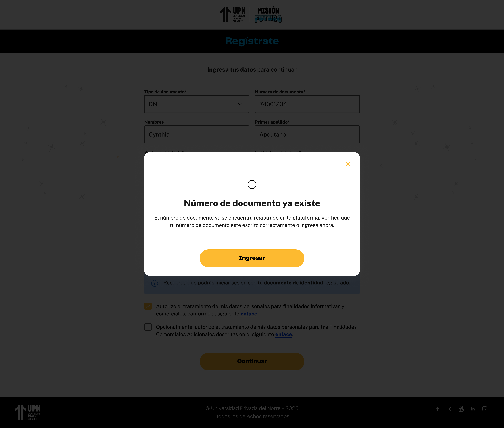

# Guía Visual: registro_error (00-registro)
**Payload General:** [../00-registro/registro_error.yaml](../00-registro/registro_error.yaml)

---
## Instancia: error
- **Descripción:** Impresión de la ventana modal de error cuando ocurre una falla en el proceso de registro.



**Data Layer (Payload):**
```yaml
{
  "event"            : "ui_interaction",                             # Nombre fijo del evento
  "ui_location"      : "modal_window",                               # Dónde está el elemento
  "ui_element"       : "modal_window",                               # Qué es el elemento
  "ui_action"        : "impression",                                 # Qué hace (open_modal, navigation, etc.)
  "ui_label"         : "error",                                      # Identificador único o texto del elemento. (En este caso es error)
  "ui_hierarchy"     : "{{seccion_actual}}",                         # Identificador semantico de la seccion donde se ubica.
  "path_location"    : "{{path_actual_del_evento}}",                 # Path de donde se mide el evento.
  "data_collected"   : "{{data_recopilada}}"                         # Mensaje de Error que se muestra en el mensaje. (Nota: Evento gemelo con error.yaml en 01-nivel-01)
}
```
