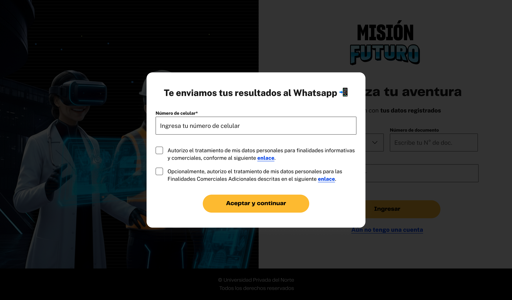

# Guía Visual: enviar_por_whatsapp (01-descubre-tus-poderes)
**Payload General:** [../01-descubre-tus-poderes/enviar_por_whatsapp.yaml](../01-descubre-tus-poderes/enviar_por_whatsapp.yaml)

---
## Instancia: enviar_por_whatsapp
- **Descripción:** Cuando el usuario hace clic en el botón "Enviar por WhatsApp" desde la ventana modal correspondiente para recibir sus resultados.



**Data Layer (Payload):**
```yaml
{
  "event"              : "ui_interaction",                                         # Nombre fijo del evento
  "ui_location"        : "modal_window",                                           # Dónde está el elemento
  "ui_element"         : "button",                                                 # Qué es el elemento
  "ui_action"          : "submit",                                                 # Qué hace (open_modal, navigation, etc.)
  "ui_label"           : "enviar_por_whatsapp",                                    # Identificador único o texto del elemento. (En este caso es Enviar por WhatsApp).
  "ui_hierarchy"       : "home > {{Nivel el cuestionario}}",                       # Identificador semántico de la sección donde se úbica. 
  "path_location"      : "{{path_actual_del_evento}}"               # Path de donde se mide el evento.
}
```
