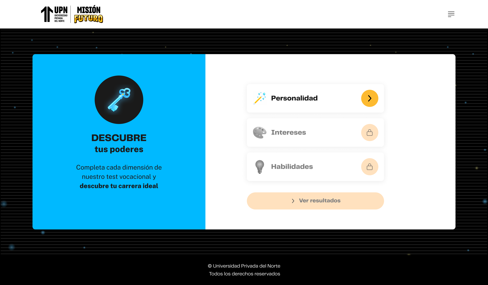
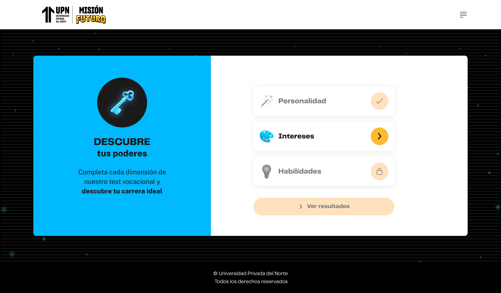
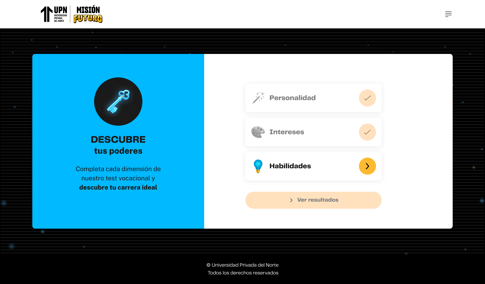
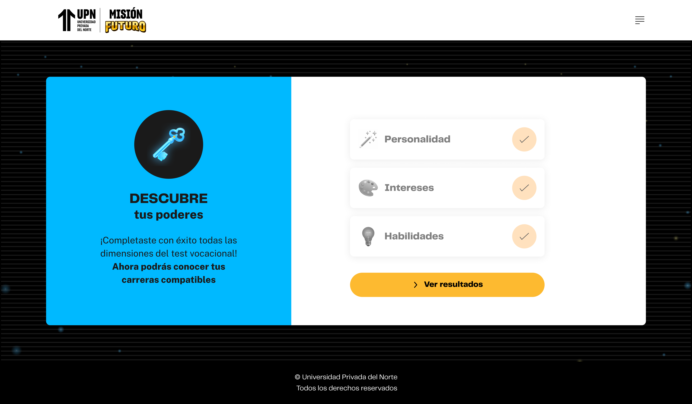

# Guía Visual: inicio (01-descubre-tus-poderes)
**Payload General:** [../01-descubre-tus-poderes/inicio.yaml](../01-descubre-tus-poderes/inicio.yaml)

Este evento de interacción se dispara cada vez que el usuario hace clic en el botón que aparece con "Descubre tus poderes" para avaznar con el test vocacional para la UPN, en ese sentido son 4 instancias a identificar.

### Resumen de Instancias por Paso


| Instancia (asset) | Instancia | `ui_hierarchy` | `path_location` |
|---|---|---|---|
| `inicio_00` | Personalidad | `home > personalidad` | `/personalidad` |
| `inicio_01` | Intereses | `home > intereses` | `/intereses` |
| `inicio_02` | Habilidades | `home > habilidades` | `/habilidades` |
| `inicio_03` | ¡Listo! | `home > ver resultados` | `/ver-resultados` |


---
## Instancia: personalidad
- **Descripción:** Cuando el usuario hace clic en el botón de iniciar del nivel de personalidad.



**Data Layer (Payload):**
```yaml
{
  "event"              : "ui_interaction",                           # Nombre fijo del evento
  "ui_location"        : "content_body",                             # Dónde está el elemento
  "ui_element"         : "button",                                   # Qué es el elemento
  "ui_action"          : "click",                                    # Qué hace (open_modal, navigation, etc.)
  "ui_label"           : "personalidad",                             # Identificador único o texto del elemento. Para este caso puede ser 3 (personalidad, intereses y habilidades)
  "ui_hierarchy"       : "home > personalidad",                      # Identificador semantico de la seccion donde se úbica. Para el nivel del evento son 3 (personalidad, intereses y habilidades)
  "path_location"      : "/personalidad",                            # Path de donde se mide el evento.
}
```


---
## Instancia: intereses
- **Descripción:** Cuando el usuario hace clic en el botón de iniciar del nivel de intereses.



**Data Layer (Payload):**
```yaml
{
  "event"              : "ui_interaction",                           # Nombre fijo del evento
  "ui_location"        : "content_body",                             # Dónde está el elemento
  "ui_element"         : "button",                                   # Qué es el elemento
  "ui_action"          : "click",                                    # Qué hace (open_modal, navigation, etc.)
  "ui_label"           : "intereses",                                # Identificador único o texto del elemento. Para este caso puede ser 3 (personalidad, intereses y habilidades)
  "ui_hierarchy"       : "home > intereses",                         # Identificador semantico de la seccion donde se úbica. Para el nivel del evento son 3 (personalidad, intereses y habilidades)
  "path_location"      : "/intereses",                               # Path de donde se mide el evento.
}
```


---
## Instancia: habilidades
- **Descripción:** Cuando el usuario hace clic en el botón de iniciar del nivel de habilidades.



**Data Layer (Payload):**
```yaml
{
  "event"              : "ui_interaction",                           # Nombre fijo del evento
  "ui_location"        : "content_body",                             # Dónde está el elemento
  "ui_element"         : "button",                                   # Qué es el elemento
  "ui_action"          : "click",                                    # Qué hace (open_modal, navigation, etc.)
  "ui_label"           : "habilidades",                              # Identificador único o texto del elemento. Para este caso puede ser 3 (personalidad, intereses y habilidades)
  "ui_hierarchy"       : "home > habilidades",                       # Identificador semantico de la seccion donde se úbica. Para el nivel del evento son 3 (personalidad, intereses y habilidades)
  "path_location"      : "/habilidades",                             # Path de donde se mide el evento.
}
```


---
## Instancia: listo
- **Descripción:** Cuando el usuario hace clic en el botón de iniciar del nivel ver resultados.



**Data Layer (Payload):**
```yaml
{
  "event"              : "ui_interaction",                           # Nombre fijo del evento
  "ui_location"        : "content_body",                             # Dónde está el elemento
  "ui_element"         : "button",                                   # Qué es el elemento
  "ui_action"          : "click",                                    # Qué hace (open_modal, navigation, etc.)
  "ui_label"           : "ver_resultados",                           # Identificador único o texto del elemento. Para este caso puede ser 3 (personalidad, intereses y habilidades)
  "ui_hierarchy"       : "home > ver resultados",                    # Identificador semantico de la seccion donde se úbica. Para el nivel del evento son 3 (personalidad, intereses y habilidades)
  "path_location"      : "/ver-resultados",                          # Path de donde se mide el evento.
}
```
