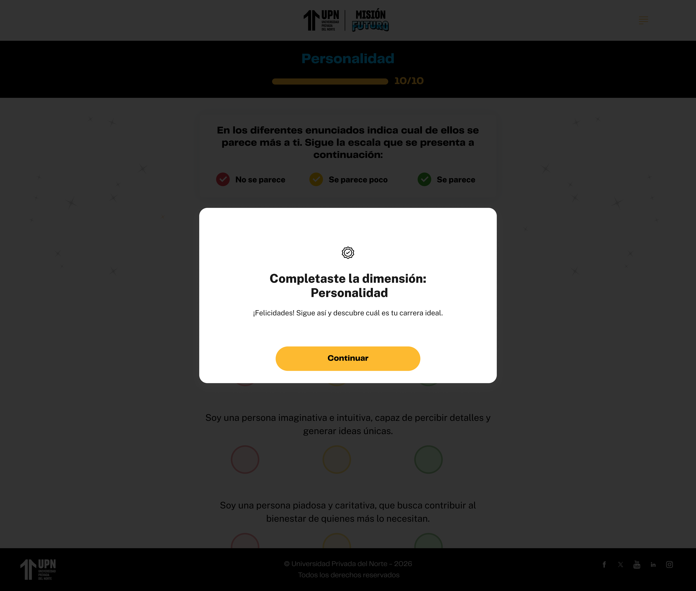
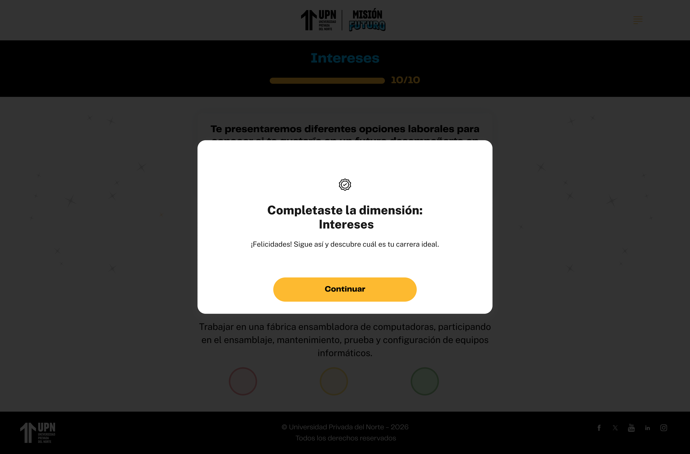
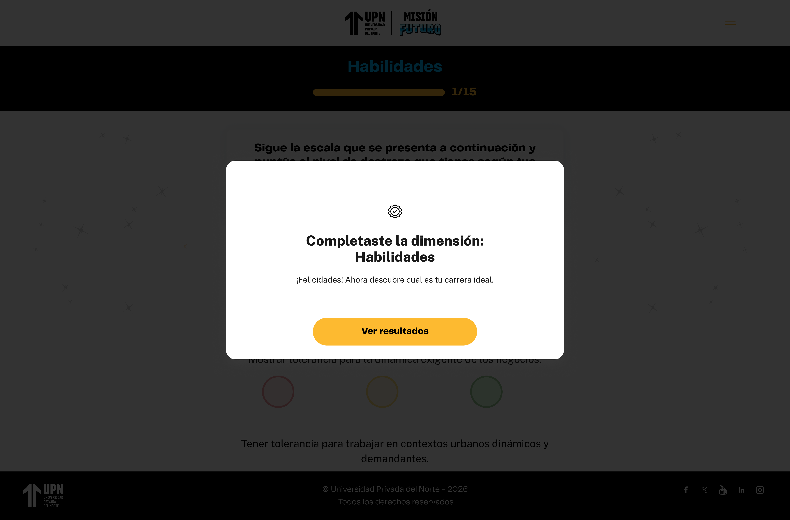

# Guía Visual: modal (01-descubre-tus-poderes)
**Payload General:** [../01-descubre-tus-poderes/modal.yaml](../01-descubre-tus-poderes/modal.yaml)

Este evento de interacción se dispara cada vez que el usuario hace clic en el botón "Completado" en la ventana modal de finalización de un cuestionario. En ese sentido, son 3 instancias a identificar.

### Resumen de Instancias por Paso

| Instancia (asset) | Cuestionario | `ui_hierarchy` | `path_location` |
|---|---|---|---|
| `modal_00` | Personalidad | `home > personalidad` | `/personalidad` |
| `modal_01` | Intereses | `home > intereses` | `/intereses` |
| `modal_02` | Habilidades | `home > habilidades` | `/habilidades` |

---
## Instancia: modal_00 — Personalidad
- **Descripción:** Cuando el usuario hace clic en el botón "Completado" en la ventana modal de finalización del cuestionario de Personalidad.



**Data Layer (Payload):**
```yaml
{
  "event"              : "ui_interaction",                                # Nombre fijo del evento
  "ui_location"        : "modal_window",                                  # Dónde está el elemento
  "ui_element"         : "button",                                        # Qué es el elemento
  "ui_action"          : "submit",                                        # Qué hace (open_modal, navigation, etc.)
  "ui_label"           : "completado",                                    # Identificador único o texto del botón presionado. En este caso es "completado".
  "ui_hierarchy"       : "home > personalidad",                           # Identificador semántico de la sección donde se ubica. 
  "path_location"      : "/personalidad"                                 # Path de donde se mide el evento.
}
```

---
## Instancia: modal_01 — Intereses
- **Descripción:** Cuando el usuario hace clic en el botón "Completado" en la ventana modal de finalización del cuestionario de Intereses.



**Data Layer (Payload):**
```yaml
{
  "event"              : "ui_interaction",                                # Nombre fijo del evento
  "ui_location"        : "modal_window",                                  # Dónde está el elemento
  "ui_element"         : "button",                                        # Qué es el elemento
  "ui_action"          : "submit",                                        # Qué hace (open_modal, navigation, etc.)
  "ui_label"           : "completado",                                    # Identificador único o texto del botón presionado. En este caso es "completado".
  "ui_hierarchy"       : "home > intereses",                              # Identificador semántico de la sección donde se ubica. 
  "path_location"      : "/intereses"                                    # Path de donde se mide el evento.
}
```

---
## Instancia: modal_02 — Habilidades
- **Descripción:** Cuando el usuario hace clic en el botón "Completado" en la ventana modal de finalización del cuestionario de Habilidades.



**Data Layer (Payload):**
```yaml
{
  "event"              : "ui_interaction",                                # Nombre fijo del evento
  "ui_location"        : "modal_window",                                  # Dónde está el elemento
  "ui_element"         : "button",                                        # Qué es el elemento
  "ui_action"          : "submit",                                        # Qué hace (open_modal, navigation, etc.)
  "ui_label"           : "completado",                                    # Identificador único o texto del botón presionado. En este caso es "completado".
  "ui_hierarchy"       : "home > habilidades",                            # Identificador semántico de la sección donde se ubica. 
  "path_location"      : "/habilidades"                                  # Path de donde se mide el evento.
}
```
