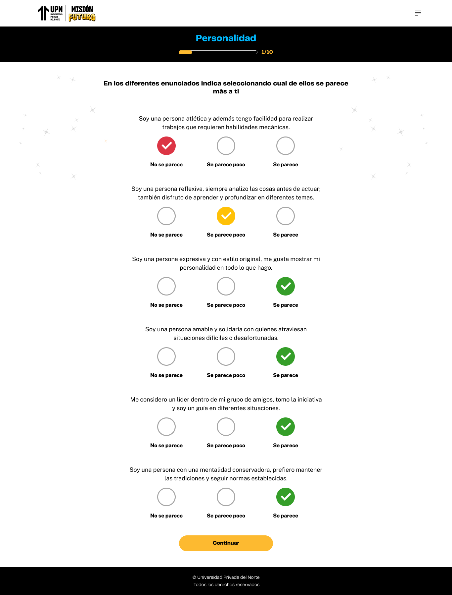

# Guía Visual: preguntas (01-descubre-tus-poderes)
**Payload General:** [../01-descubre-tus-poderes/preguntas.yaml](../01-descubre-tus-poderes/preguntas.yaml)

---
## Instancia: preguntas
- **Descripción:** Cuando el usuario hace clic en un botón de opción para responder una pregunta del cuestionario de autoconocimiento.

### Valores de Jerarquía y URL por Pregunta y Nivel

| Cuestionario (Nivel) | Pregunta | `ui_hierarchy` | `path_location` |
|---|---|---|---|
| Personalidad | 1 | `home > personalidad > pregunta_01` | `/personalidad` |
| Personalidad | 2 | `home > personalidad > pregunta_02` | `/personalidad` |
| Personalidad | ... | ... | ... |
| Personalidad | N | `home > personalidad > pregunta_{N}` | `/personalidad` |
| Intereses | 1 | `home > intereses > pregunta_01` | `/intereses` |
| Intereses | 2 | `home > intereses > pregunta_02` | `/intereses` |
| Intereses | ... | ... | ... |
| Intereses | N | `home > intereses > pregunta_{N}` | `/intereses` |
| Habilidades | 1 | `home > habilidades > pregunta_01` | `/habilidades` |
| Habilidades | 2 | `home > habilidades > pregunta_02` | `/habilidades` |
| Habilidades | ... | ... | ... |
| Habilidades | N | `home > habilidades > pregunta_{N}` | `/habilidades` |

---



**Data Layer (Payload):**
```yaml
{
  "event"              : "ui_interaction",                                                         # Nombre fijo del evento
  "ui_location"        : "content_body",                                                           # Dónde está el elemento
  "ui_element"         : "button",                                                                 # Qué es el elemento
  "ui_action"          : "submit",                                                                 # Qué hace (open_modal, navigation, etc.)
  "ui_label"           : "{{nombre_del_boton}}",                                                   # Identificador único o texto del botón presionado.
  "ui_hierarchy"       : "home > {{Nivel del cuestionario}} > pregunta_{n_pregunta}",              # Identificador semántico de la sección. El n_pregunta debe ir con zero-padding (ej. pregunta_01).
  "path_location"      : "{{path_actual_del_evento}}",                                             # Path de donde se mide el evento (ej: /personalidad, /intereses, /habilidades).
  "data_collected"     : "{{pregunta_y_respuesta}}",                                               # Se guarda la pregunta y respuesta (ej. "pregunta: [Pregunta] | respuesta: [Respuesta]").
}
```
