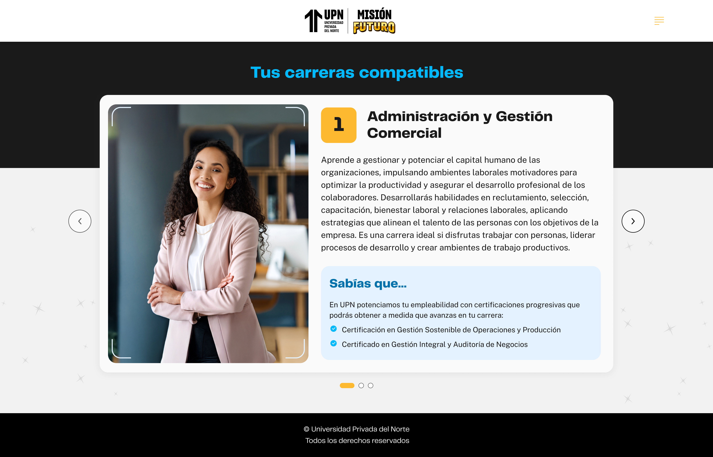

# Guía Visual: valoracion_carreras (01-descubre-tus-poderes)
**Payload General:** [../01-descubre-tus-poderes/valoracion_carreras.yaml](../01-descubre-tus-poderes/valoracion_carreras.yaml)

---
## Instancia: valoracion_carreras
- **Descripción:** Cuando el usuario hace clic en los botones de navegación o selección de carreras ("Siguiente", "Anterior", "Me interesa", "No me interesa").



**Data Layer (Payload):**
```yaml
{
  "event"              : "ui_interaction",                                   # Nombre fijo del evento
  "ui_location"        : "content_body",                                     # Dónde está el elemento
  "ui_element"         : "button",                                           # Qué es el elemento
  "ui_action"          : "click",                                            # Qué hace (open_modal, navigation, etc.)
  "ui_label"           : "{{valor_de_respuesta}}",                           # Identificador único o texto del elemento. Valores posibles: "Siguiente" o "Anterior".
  "ui_hierarchy"       : "home > {{Nivel el cuestionario}}",                 # Identificador semántico de la sección donde se úbica. 
  "path_location"      : "{{path_actual_del_evento}}",                       # Path de donde se mide el evento.
  "data_collected"     : "{{nro_orden_y_carrera}}"                           # Aquí debe ir el orden y la carrera que es aceptada o rechazada. (ej. "nro_orden: 1 | carrera: Odontología").
}
```
