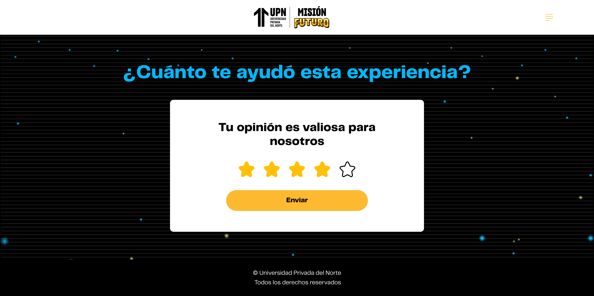

# Guía Visual: button_csat_enviar (03-csat)
**Payload General:** [../03-csat/button_csat_enviar.yaml](../03-csat/button_csat_enviar.yaml)

---
## Instancia: enviar_csat
- **Descripción:** Cuando el usuario envía la valoración CSAT de satisfacción al finalizar la experiencia.



**Data Layer (Payload):**
```yaml
{
  "event"           : "ui_interaction",                              # Nombre fijo del evento
  "ui_location"     : "form_container",                                 # Dónde está el elemento
  "ui_element"      : "button",                                      # Qué es el elemento
  "ui_action"       : "submit",                                      # Qué hace (open_modal, navigation, etc.)
  "ui_label"        : "enviar_csat",                                 # Identificador único o texto del elemento. (En este caso es Enviar CSAT)
  "ui_hierarchy"    : "home > {{seccion_actual}} > csat",            # Identificador semántico de la sección donde se ubica (ej. home > personalidad > csat o home > intereses > csat).
  "path_location"   : "{{path_actual_del_evento}}" ,                 # Path de donde se mide el evento.
  "csat_value"      : "{{valor_de_csat}}" ,                          # Valor de las estrellas (1-5).
  "data_collected"  : "{{data_recopilada}}"                          # Mensaje del CSAT
}
```
