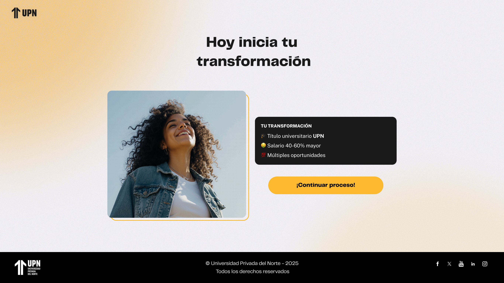

# Guía Visual: inicio (00-home)
**Payload General:** [../00-home/inicio.yaml](../00-home/inicio.yaml)

---
## Instancia: continuar_proceso
- **Descripción:** Cuando el usuario hace clic en el botón "¡Continuar proceso!" de la pantalla principal (Home).



**Data Layer (Payload):**
```yaml
{
  "event"            : "ui_interaction",                    # Nombre fijo del evento
  "ui_location"      : "form_container",                    # Dónde está el elemento
  "ui_element"       : "button",                            # Qué es el elemento
  "ui_action"        : "click",                             # Qué hace (open_modal, navigation, etc.)
  "ui_label"         : "continuar_proceso",                 # Identificador único o texto del elemento. (En este caso es "continuar_proceso")
  "ui_hierarchy"     : "home",                              # Identificador semantico de la seccion donde se ubica. En este caso home.
  "path_location"    : "/",                                 # Path de donde se mide el evento.
  "user_code"        : "{{id_usuario}}"                     # Codigo de usuario (prospecto, código de Hubspot), para identificación de un usuario.
}
```
