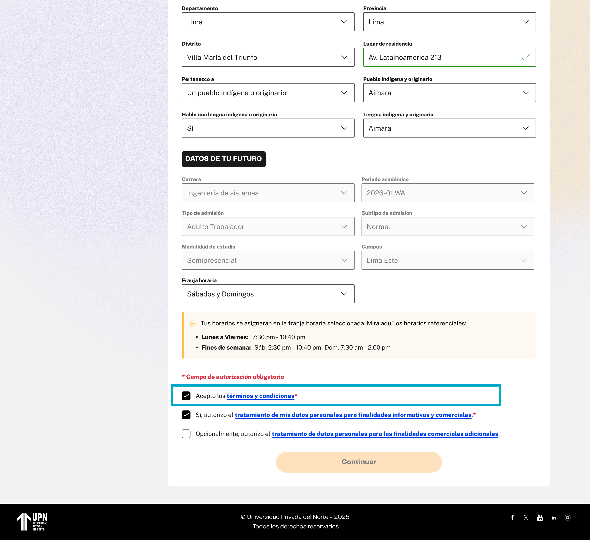
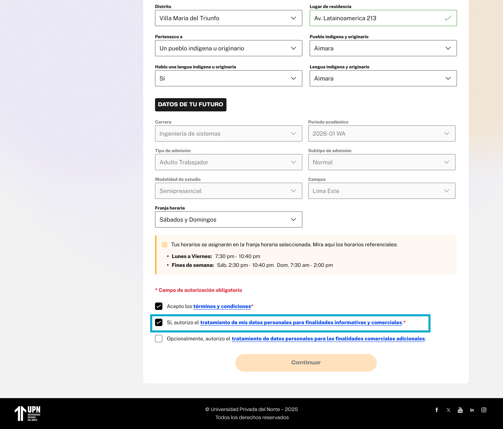
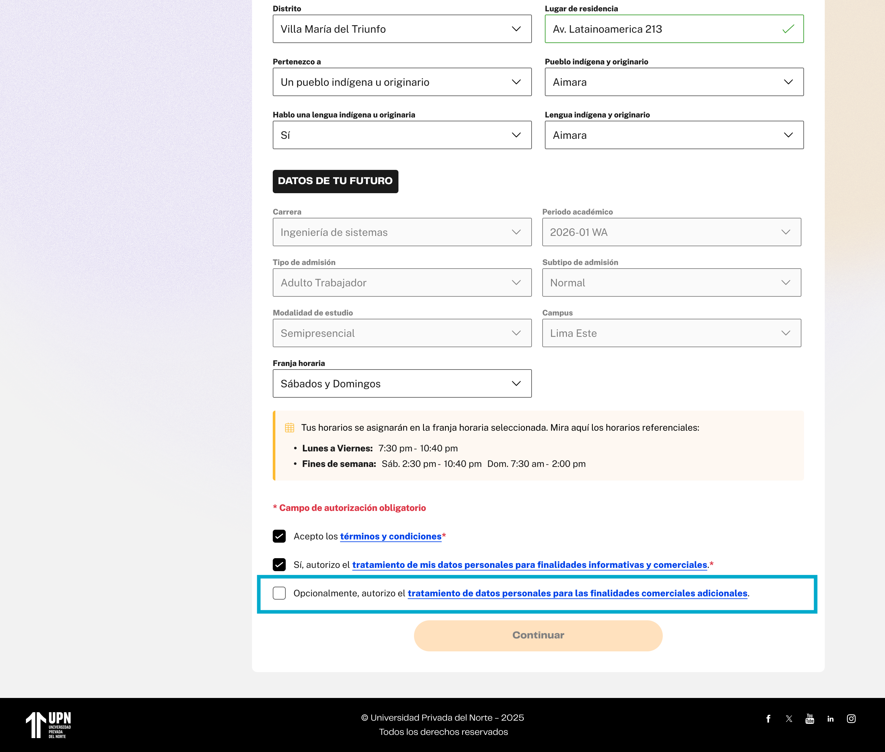

# Guía Visual: check-condiciones (01-registro)
**Payload General:** [../01-registro/check-condiciones.yaml](../01-registro/check-condiciones.yaml)

Este evento de interacción se dispara cada vez que el usuario marca o desmarca uno de los checkboxes del formulario de registro. En ese sentido, son 3 instancias a identificar.

### Resumen de Instancias de Checkboxes de Registro

| Instancia (asset) | Checkbox | `ui_hierarchy` | `path_location` |
|---|---|---|---|
| `check_condiciones_00` | Términos y condiciones | `home > registro` | `/registro` |
| `check_condiciones_01` | Tratamiento de datos obligatorio | `home > registro` | `/registro` |
| `check_condiciones_02` | Tratamiento de datos opcional | `home > registro` | `/registro` |

---
## Instancia: terminos_y_condiciones
- **Descripción:** Cuando el usuario marca el checkbox para autorizar los Términos y Condiciones.



**Data Layer (Payload):**
```yaml
{
  "event"            : "ui_interaction",                    # Nombre fijo del evento
  "ui_location"      : "form_container",                    # Dónde está el elemento
  "ui_element"       : "checkbox",                          # Qué es el elemento
  "ui_action"        : "click",                             # Qué hace (open_modal, navigation, etc.)
  "ui_label"         : "terminos_y_condiciones",            # Identificador único o texto del elemento.
  "ui_hierarchy"     : "home > registro",                   # Identificador semántico de la sección donde se ubica.
  "path_location"    : "/registro",                         # Path de donde se mide el evento.
  "data_collected"   : "{{data_recopilada}}"                # Se recomienda guardar el estado del checkbox (marcado/desmarcado).
}
```

---
## Instancia: tratamiento_datos_obligatorio
- **Descripción:** Cuando el usuario marca el checkbox para autorizar el tratamiento obligatorio de sus datos personales.



**Data Layer (Payload):**
```yaml
{
  "event"            : "ui_interaction",                    # Nombre fijo del evento
  "ui_location"      : "form_container",                    # Dónde está el elemento
  "ui_element"       : "checkbox",                          # Qué es el elemento
  "ui_action"        : "click",                             # Qué hace (open_modal, navigation, etc.)
  "ui_label"         : "tratamiento_datos_obligatorio",     # Identificador único o texto del elemento.
  "ui_hierarchy"     : "home > registro",                   # Identificador semántico de la sección donde se ubica.
  "path_location"    : "/registro",                         # Path de donde se mide el evento.
  "data_collected"   : "{{data_recopilada}}"                # Se recomienda guardar el estado del checkbox (marcado/desmarcado).
}
```

---
## Instancia: tratamiento_datos_opcional
- **Descripción:** Cuando el usuario marca el checkbox para autorizar el tratamiento opcional de sus datos personales para finalidades comerciales y promocionales.



**Data Layer (Payload):**
```yaml
{
  "event"            : "ui_interaction",                    # Nombre fijo del evento
  "ui_location"      : "form_container",                    # Dónde está el elemento
  "ui_element"       : "checkbox",                          # Qué es el elemento
  "ui_action"        : "click",                             # Qué hace (open_modal, navigation, etc.)
  "ui_label"         : "tratamiento_datos_opcional",        # Identificador único o texto del elemento.
  "ui_hierarchy"     : "home > registro",                   # Identificador semántico de la sección donde se ubica.
  "path_location"    : "/registro",                         # Path de donde se mide el evento.
  "data_collected"   : "{{data_recopilada}}"                # Se recomienda guardar el estado del checkbox (marcado/desmarcado).
}
```
