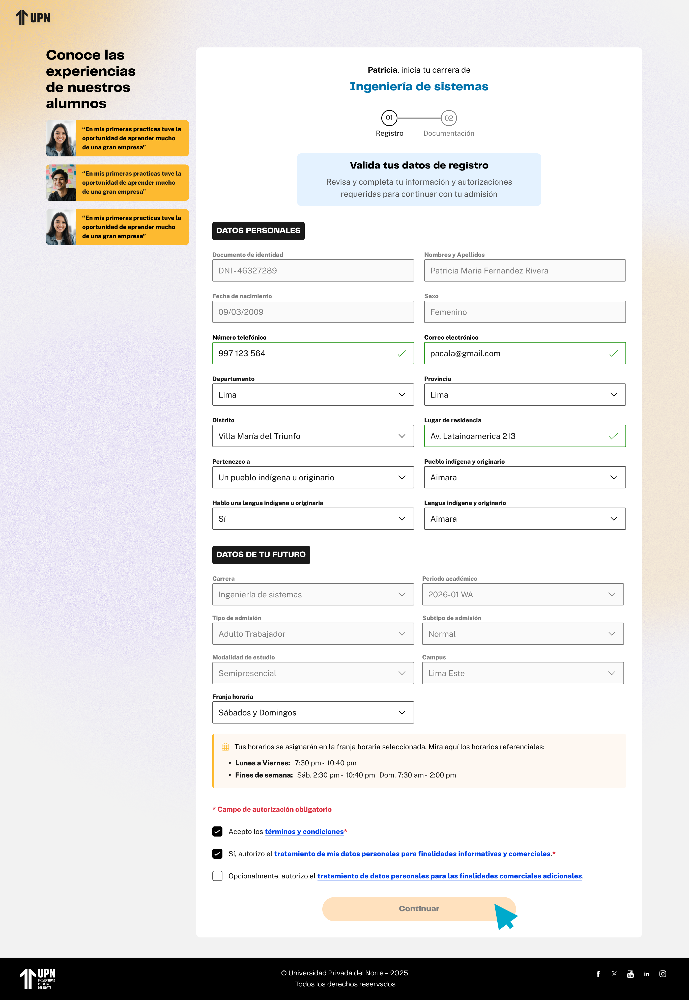

# Guía Visual: registro-alumno (01-registro)
**Payload General:** [../01-registro/registro-alumno.yaml](../01-registro/registro-alumno.yaml)

---
## Instancia: continuar
- **Descripción:** Cuando el usuario hace clic en el botón "Continuar" para avanzar en el formulario de registro de alumno.



**Data Layer (Payload):**
```yaml
{
  "event"            : "ui_interaction",                    # Nombre fijo del evento
  "ui_location"      : "form_container",                    # Dónde está el elemento
  "ui_element"       : "button",                            # Qué es el elemento
  "ui_action"        : "click",                             # Qué hace (open_modal, navigation, etc.)
  "ui_label"         : "continuar",                         # Identificador único o texto del elemento. (En este caso es "continuar")
  "ui_hierarchy"     : "home > registro",                   # Identificador semantico de la seccion donde se ubica. En este caso registro.
  "path_location"    : "/registro",                         # Path de donde se mide el evento.
  "data_collected"   : "{{data_recopilada}}"                # Se recomienda guardar los datos de la respuesta del Formulario como: Carrera, Modalidad, Horario, Campus, Periodo.
}
```
