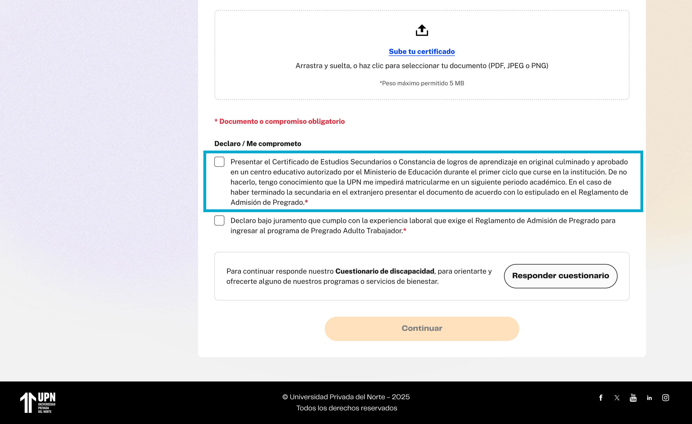
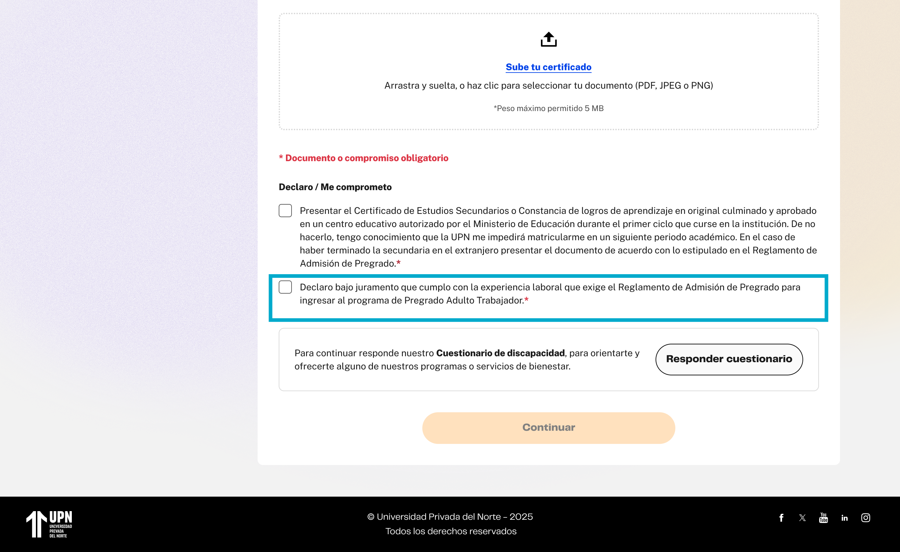

# Guía Visual: check-declaraciones (02-documentos)
**Payload General:** [../02-documentos/check-declaraciones.yaml](../02-documentos/check-declaraciones.yaml)

Este evento de interacción se dispara cada vez que el usuario marca o desmarca uno de los checkboxes de declaraciones en el paso de documentos. En ese sentido, son 2 instancias a identificar.

### Resumen de Instancias de Checkboxes de Declaraciones

| Instancia (asset) | Checkbox | `ui_hierarchy` | `path_location` |
|---|---|---|---|
| `check_declaraciones_00` | Certificado de Estudios | `home > documentos` | `/documentos` |
| `check_declaraciones_01` | Juramento de Experiencia Laboral | `home > documentos` | `/documentos` |

---
## Instancia: certificado_estudios
- **Descripción:** Cuando el usuario marca el checkbox correspondiente a la declaración de entrega del Certificado de Estudios.



**Data Layer (Payload):**
```yaml
{
  "event"            : "ui_interaction",                    # Nombre fijo del evento
  "ui_location"      : "form_container",                    # Dónde está el elemento
  "ui_element"       : "checkbox",                          # Qué es el elemento
  "ui_action"        : "click",                             # Qué hace (open_modal, navigation, etc.)
  "ui_label"         : "certificado_estudios",              # Identificador único o texto del elemento.
  "ui_hierarchy"     : "home > documentos",                 # Identificador semántico de la sección donde se ubica.
  "path_location"    : "/documentos",                       # Path de donde se mide el evento.
  "data_collected"   : "{{data_recopilada}}"                # Se recomienda guardar el estado del checkbox (marcado/desmarcado) de la declaración correspondiente.
}
```

---
## Instancia: juramento_experiencia_laboral
- **Descripción:** Cuando el usuario marca el checkbox correspondiente al Juramento de Experiencia Laboral.



**Data Layer (Payload):**
```yaml
{
  "event"            : "ui_interaction",                    # Nombre fijo del evento
  "ui_location"      : "form_container",                    # Dónde está el elemento
  "ui_element"       : "checkbox",                          # Qué es el elemento
  "ui_action"        : "click",                             # Qué hace (open_modal, navigation, etc.)
  "ui_label"         : "juramento_experiencia_laboral",     # Identificador único o texto del elemento.
  "ui_hierarchy"     : "home > documentos",                 # Identificador semántico de la sección donde se ubica.
  "path_location"    : "/documentos",                       # Path de donde se mide el evento.
  "data_collected"   : "{{data_recopilada}}"                # Se recomienda guardar el estado del checkbox (marcado/desmarcado) de la declaración correspondiente.
}
```
