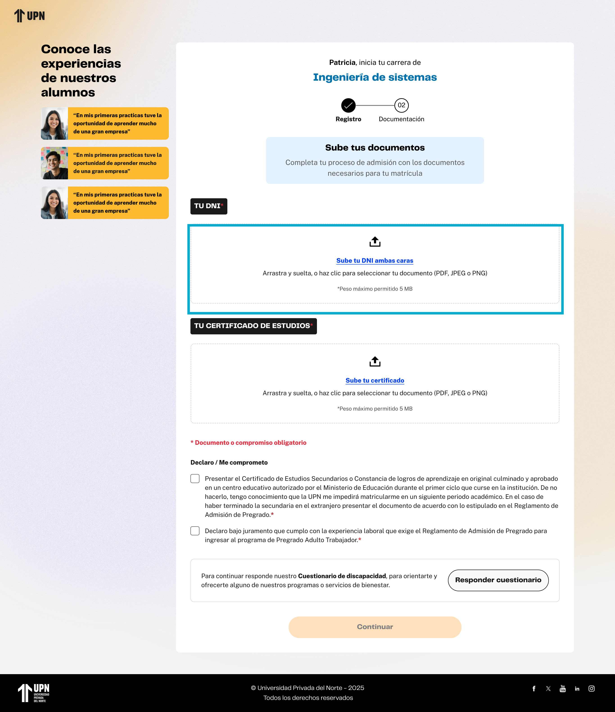

# Guía Visual: responder-cuestionario (02-documentos)
**Payload General:** [../02-documentos/responder-cuestionario.yaml](../02-documentos/responder-cuestionario.yaml)

---
## Instancia: responder_cuestionario
- **Descripción:** Cuando el usuario hace clic en el botón "Responder cuestionario" correspondiente al cuestionario de discapacidad.



**Data Layer (Payload):**
```yaml
{
  "event"            : "ui_interaction",                    # Nombre fijo del evento
  "ui_location"      : "form_container",                    # Dónde está el elemento
  "ui_element"       : "button",                            # Qué es el elemento
  "ui_action"        : "click",                             # Qué hace (open_modal, navigation, etc.)
  "ui_label"         : "responder_cuestionario",            # Identificador único o texto del elemento. (En este caso es "responder cuestionario")
  "ui_hierarchy"     : "home > documentos",                 # Identificador semantico de la seccion donde se ubica. En este caso documentos.
  "path_location"    : "/documentos"                        # Path de donde se mide el evento.
}
```
