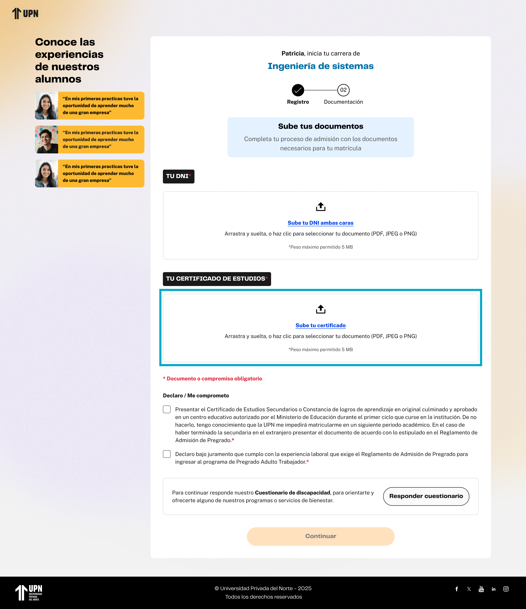

# Guía Visual: subir-certificado-estudios (02-documentos)
**Payload General:** [../02-documentos/subir-certificado-estudios.yaml](../02-documentos/subir-certificado-estudios.yaml)

---
## Instancia: subir_certificado_estudios
- **Descripción:** Cuando el usuario interactúa con el botón para subir su certificado de estudios.



**Data Layer (Payload):**
```yaml
{
  "event"            : "ui_interaction",                    # Nombre fijo del evento
  "ui_location"      : "form_container",                    # Dónde está el elemento
  "ui_element"       : "button",                            # Qué es el elemento
  "ui_action"        : "click",                             # Qué hace (open_modal, navigation, etc.)
  "ui_label"         : "subir_certificado_estudios",        # Identificador único o texto del elemento. (En este caso es "subir certificado de estudios")
  "ui_hierarchy"     : "home > documentos",                 # Identificador semantico de la seccion donde se ubica. En este caso documentos.
  "path_location"    : "/documentos",                       # Path de donde se mide el evento.
  "data_collected"   : "{{nombre_y_formato_archivo}}"       # Nombre y formato/extensión del archivo subido.
}
```
