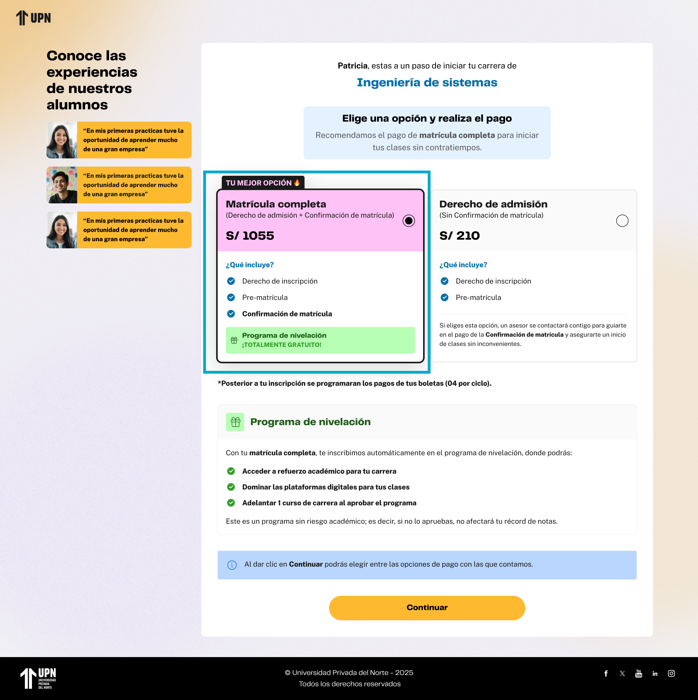
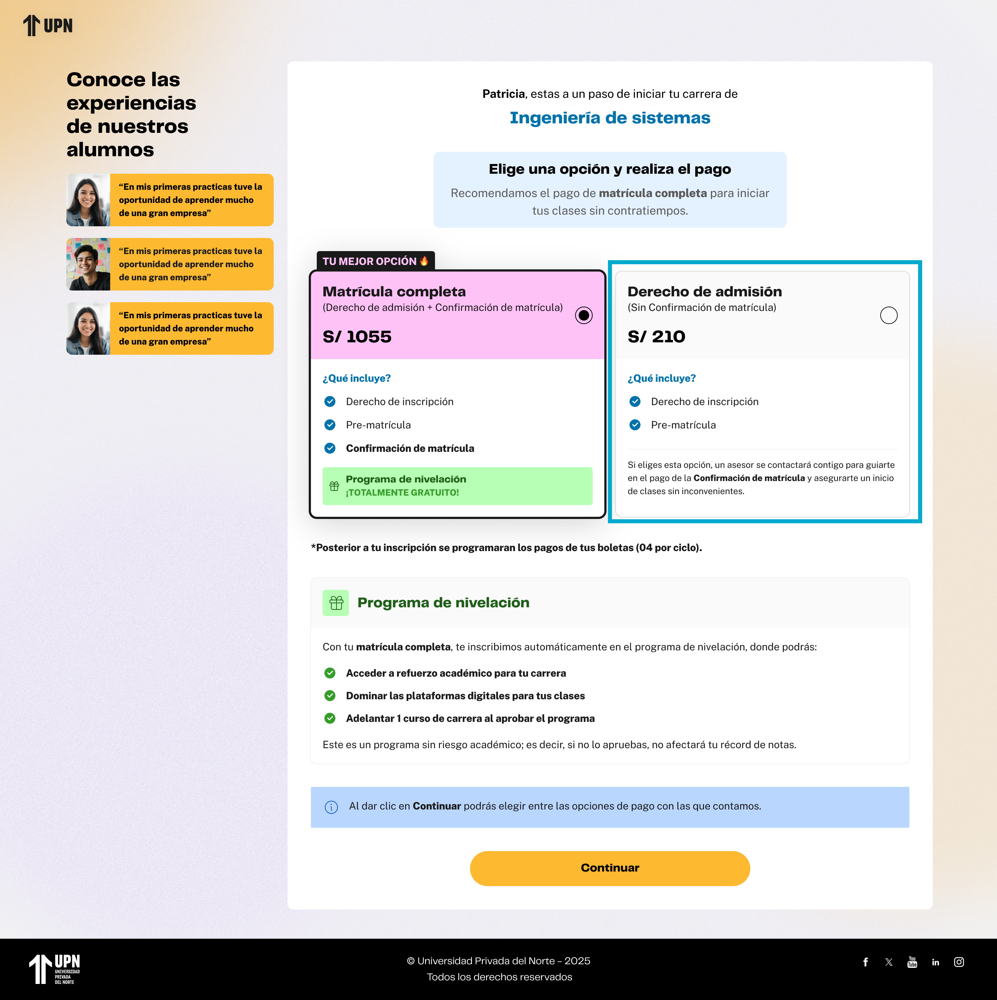

# Guía Visual: check-tipo-pago (03-pagos)
**Payload General:** [../03-pagos/check-tipo-pago.yaml](../03-pagos/check-tipo-pago.yaml)

Este evento de interacción se dispara cada vez que el usuario selecciona una de las opciones de tipo de pago en el paso de pagos. En ese sentido, son 2 instancias a identificar.

### Resumen de Instancias de Checkboxes de Pago

| Instancia (asset) | Checkbox | `ui_hierarchy` | `path_location` |
|---|---|---|---|
| `check_tipo_pago_00` | Matrícula Completa | `home > pagos` | `/pagos` |
| `check_tipo_pago_01` | Derecho de Admisión | `home > pagos` | `/pagos` |

---
## Instancia: matricula_completa
- **Descripción:** Cuando el usuario selecciona la opción de checkbox correspondiente a Matrícula Completa.



**Data Layer (Payload):**
```yaml
{
  "event"            : "ui_interaction",                    # Nombre fijo del evento
  "ui_location"      : "form_container",                    # Dónde está el elemento
  "ui_element"       : "checkbox",                          # Qué es el elemento
  "ui_action"        : "click",                             # Qué hace (open_modal, navigation, etc.)
  "ui_label"         : "matricula_completa",                # Identificador único o texto del elemento.
  "ui_hierarchy"     : "home > pagos",                      # Identificador semántico de la sección donde se ubica. En este caso pagos.
  "path_location"    : "/pagos",                            # Path de donde se mide el evento.
  "data_collected"   : "{{data_recopilada}}"                # Se recomienda guardar los datos de la respuesta del Formulario como el monto del Pago.
}
```

---
## Instancia: derecho_de_admision
- **Descripción:** Cuando el usuario selecciona la opción de checkbox correspondiente a Derecho de Admisión.



**Data Layer (Payload):**
```yaml
{
  "event"            : "ui_interaction",                    # Nombre fijo del evento
  "ui_location"      : "form_container",                    # Dónde está el elemento
  "ui_element"       : "checkbox",                          # Qué es el elemento
  "ui_action"        : "click",                             # Qué hace (open_modal, navigation, etc.)
  "ui_label"         : "derecho_de_admision",               # Identificador único o texto del elemento.
  "ui_hierarchy"     : "home > pagos",                      # Identificador semántico de la sección donde se ubica. En este caso pagos.
  "path_location"    : "/pagos",                            # Path de donde se mide el evento.
  "data_collected"   : "{{data_recopilada}}"                # Se recomienda guardar los datos de la respuesta del Formulario como el monto del Pago.
}
```
