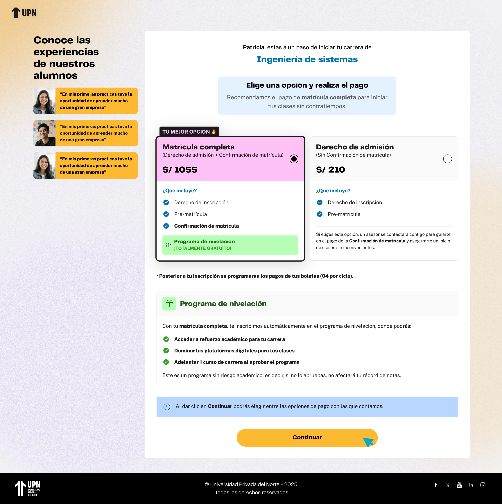

# Guía Visual: continuar-pagos (03-pagos)
**Payload General:** [../03-pagos/continuar-pagos.yaml](../03-pagos/continuar-pagos.yaml)

---
## Instancia: continuar
- **Descripción:** Cuando el usuario hace clic en el botón "Continuar" para avanzar en el paso de pagos.



**Data Layer (Payload):**
```yaml
{
  "event"            : "ui_interaction",                    # Nombre fijo del evento
  "ui_location"      : "form_container",                    # Dónde está el elemento
  "ui_element"       : "button",                            # Qué es el elemento
  "ui_action"        : "click",                             # Qué hace (open_modal, navigation, etc.)
  "ui_label"         : "continuar",                         # Identificador único o texto del elemento. (En este caso es "Continuar")
  "ui_hierarchy"     : "home > pagos",                      # Identificador semantico de la seccion donde se ubica. En este caso pagos.
  "path_location"    : "/pagos"                             # Path de donde se mide el evento.
}
```
