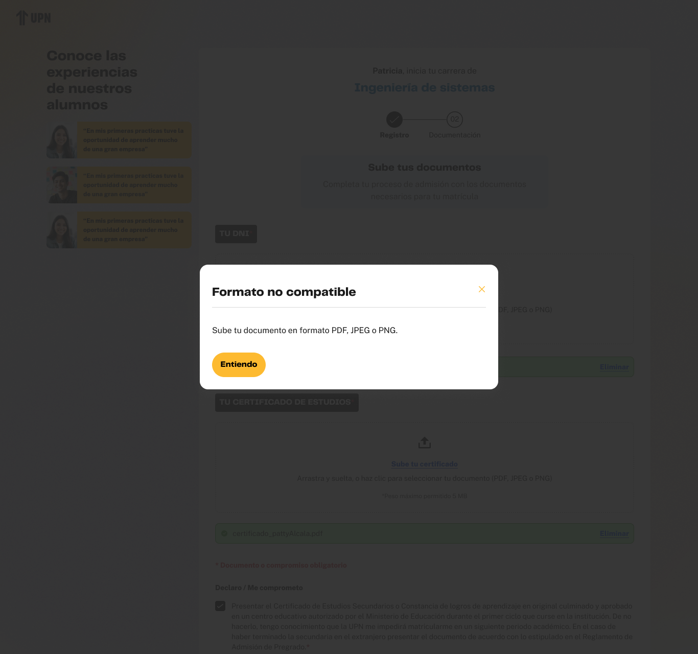

# Guía Visual: error (04-error)
**Payload General:** [../04-error/error.yaml](../04-error/error.yaml)

---
## Instancia: Ir a WhatsApp
- **Descripción:** Cuando se despliega una ventana modal de error y el usuario hace clic en el botón "Ir a WhatsApp" para contactar soporte.



**Data Layer (Payload):**
```yaml
{
  "event"            : "ui_interaction",                       # Nombre fijo del evento
  "ui_location"      : "modal_window",                         # Dónde está el elemento
  "ui_element"       : "modal_window",                         # Qué es el elemento
  "ui_action"        : "click",                                # Qué hace (open_modal, navigation, etc.)
  "ui_label"         : "Ir a WhatsApp",                        # Identificador único o texto del elemento. (En este caso es "Ir a WhatsApp")
  "ui_hierarchy"     : "{{hierarchy donde se de el evento}}",  # Identificador semantico de la seccion donde se ubica. 
  "path_location"    : "{{URI donde ocurre el error}}",        # Path de donde se mide el evento.
  "data_collected"   : "{{data_recopilada}}",                  # Se recomienda recopilar el mensaje de error, para reportes posteriores.
  "user_code"        : "{{id_usuario}}"                        # Codigo de usuario (prospecto, código de Hubspot), para identificación de un usuario.
}
```
