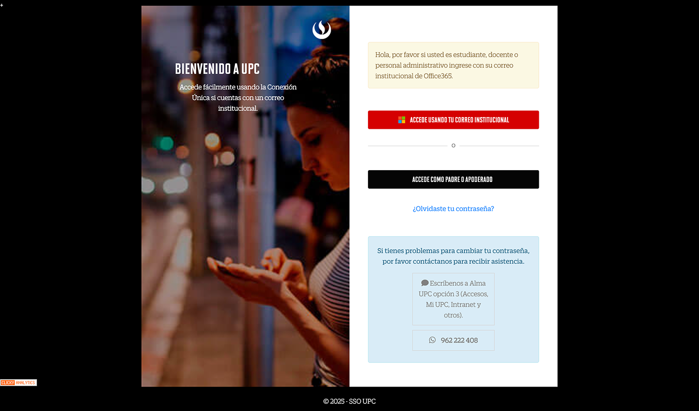

# Guía Visual: Login
**Payload General:** [login.yaml](../00-login/login.yaml)

---
## Instancia: Login
- **Descripción:** Este evento se levanta cuando en la Pantalla cuando un Alumno se Loguea a la Plataforma.



**Data Layer (Payload):**
```yaml
{
  "user_id"             : "{{id_usuario}}",        # Codigo de usuario (estudiante, docente)
  "user_ciclo_academico": "{{ciclo_academico}}",   # Ciclo academico del usuario
  "user_unidad_negocio" : "{{unidad_negocio}}",    # UG, CAD, EPE, etc.
  "user_producto"       : "{{producto}}",          # Producto o carrera.
  "user_categoria"      : "{{categoria}}"          # Si es estudiante, docente, administrador, etc.
}
```
