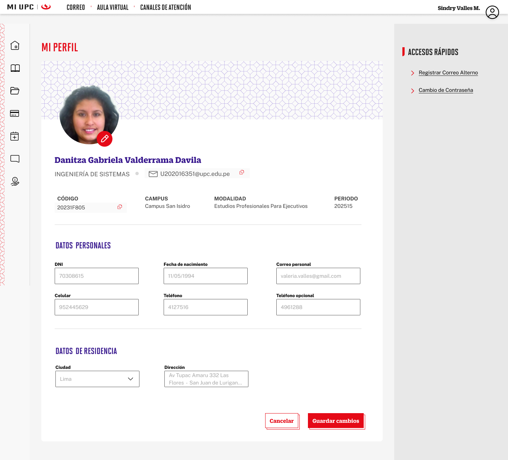

# Guía Visual: Search/Editar-MiPerfil
**Payload General:** [search_editar_miperfil.yaml](../02-perfil/search_editar_miperfil.yaml)

---
## Instancia: Search/Editar-MiPerfil
- **Descripción:** Este evento mide el clic a la sección de buscar la información laboral dentro de Mi Perfil.



**Data Layer (Payload):**
```yaml
{
  "event"           : "ui_interaction",                # Nombre fijo del evento
  "ui_location"     : "content_body",                      # Dónde está el elemento (content_body)
  "ui_element"      : "input_field",                       # Qué es el elemento (input_field)
  "ui_action"       : "search",                      # Qué hace (search)
  "ui_label"        : "search_editar_miperfil",                      # Identificador único del elemento (search_editar_miperfil)
  "ui_hierarchy"    : "portal > perfil",                     # Identificador semántico de la sección
  "link_url"        : null,                        # Si dirige a otro sitio o abre un modal (URL destino o null)
  "path_location"   : "{{path_actual_del_evento}}",    # URL y/o path de donde se da el evento
  "data_collected"  : null,                            # Datos recopilados (mensajes de error, etc.)
  "csat_value"      : null                             # Solo para CSAT (0 a 5)
}
```
