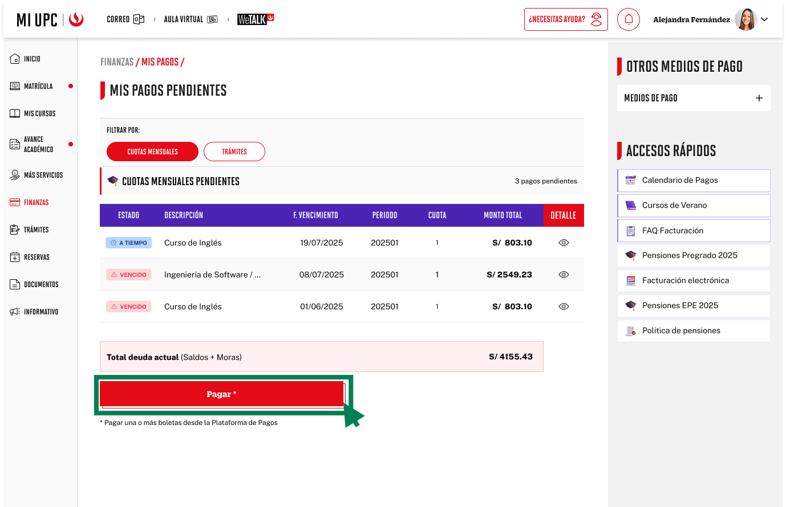

# Guía Visual: Click-BotonMediosDePagoPopup
**Payload General:** [click_botonmediosdepagopopup.yaml](../05-finanzas/click_botonmediosdepagopopup.yaml)

---
## Instancia: Click-BotonMediosDePagoPopup
- **Descripción:** Este evento mide el clic en Medios de Pago en cada Pop Up de Obligaciones por Pagar.



**Data Layer (Payload):**
```yaml
{
  "event"           : "ui_interaction",                # Nombre fijo del evento
  "ui_location"     : "content_body",                      # Dónde está el elemento (content_body)
  "ui_element"      : "button",                       # Qué es el elemento (button)
  "ui_action"       : "open_modal",                      # Qué hace (open_modal)
  "ui_label"        : "click_botonmediosdepagopopup",                      # Identificador único del elemento (click_botonmediosdepagopopup)
  "ui_hierarchy"    : "portal_upc > obligaciones_por_pagar",                     # Identificador semántico de la sección
  "link_url"        : null,                        # Si dirige a otro sitio o abre un modal (URL destino o null)
  "path_location"   : "{{path_actual_del_evento}}",    # URL y/o path de donde se da el evento
  "data_collected"  : null                            # Datos recopilados (mensajes de error, etc.)
}
```

 