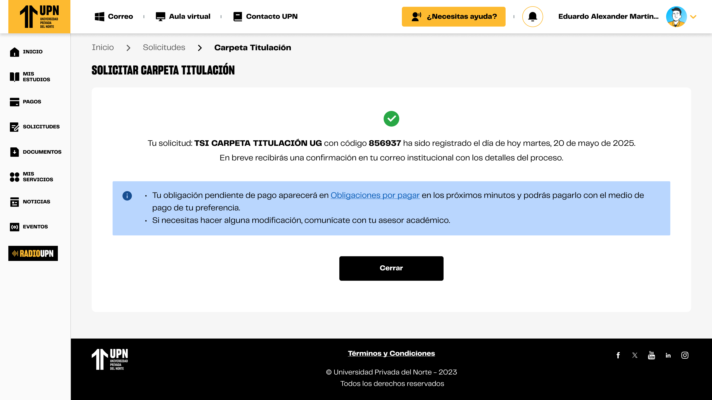

# Guía Visual: titulacion_solicitudRegistrada
**Payload General:** [titulacion_solicitudregistrada.yaml](../07-tramites/titulacion_solicitudregistrada.yaml)

---
## Instancia: titulacion_solicitudRegistrada
- **Descripción:** Este evento mide el evento de Solicitud Registrada del grado de Titulación dentro de los tramites que se va a realizar.



**Data Layer (Payload):**
```yaml
{
  "event"           : "ui_interaction",                # Nombre fijo del evento
  "ui_location"     : "content_body",                      # Dónde está el elemento (content_body)
  "ui_element"      : "button",                       # Qué es el elemento (button)
  "ui_action"       : "click",                      # Qué hace (click)
  "ui_label"        : "titulacion_solicitudregistrada",                      # Identificador único del elemento (titulacion_solicitudregistrada)
  "ui_hierarchy"    : "portal_upn > tramites",                     # Identificador semántico de la sección
  "link_url"        : null,                        # Si dirige a otro sitio o abre un modal (URL destino o null)
  "path_location"   : "{{path_actual_del_evento}}",    # URL y/o path de donde se da el evento
  "data_collected"  : null                            # Datos recopilados (mensajes de error, etc.)
}
```
